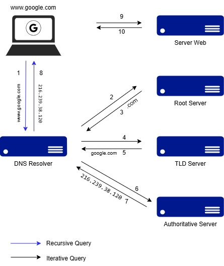

# DNS (Domain Name System)

DNS adalah sistem yang berfungsi untuk menerjemahkan nama domain menjadi alamat IP yang dapat dimengerti oleh komputer. sebagai contoh domain **www.google.com** diterjemahkan menjadi **216.239.38.120**. Proses ini memungkinkan pengguna mengakses layanan di internet dengan menggunakan nama domain yang mudah diingat, tanpa harus mengingat alamat IP yang kompleks

  

## Cara Kerja DNS

**1. Permintaan DNS (Query DNS)**
-   Pengguna memasukan URL (misal www.google.com) di browser. perangkat tidak langsung mengerti alamat tersebut, karena yang dibutuhkan adalah alamat IP.

**2. Memulai Proses Resolusi DNS**
-   Permintaan pertama dikirimkan ke resolver DNS. Resolver ini biasanya disediakan oleh ISP (Internet Service Provider) atau penyedia layanan DNS (seperti Google DNS atau Cloudflare).

**3. Cek Cache Lokal**
-   sebelum mengirim permintaan ke server DNS, perangkat akan cek terlebih dahulu apakah alamat IP dari domain diminta sudah ada. kalau ada maka proses berhenti disini, jika tidak ada maka permintaan akan diteruskan ke server DNS

**4. Query ke Root Nameserver**
-   Resolver mengirimkan permintaan ke Root Nameserver. Tugas Root Nameserver adalah memberi petunjuk ke server DNS berikutnya yang lebih spesifik untuk menangani domain tertentu.

**5. Query ke TLD Nameserver**
-   TLD (Top Level Domain), menangani domain dengan ekstensi tertentu (misal .com, .net, atau .org).
-   url yang diminta adalah www.google.com, maka Root Nameserver akan meneruskan permintaan ke TLD nameserver untuk mengelola domain .com

**6. Query ke Authoritative Nameserver**
-   Authoritative nameserver adalah server yang menyimpan catatan DNS resmi untuk domain tertentu, misal www.google.com alamat IP nya adalah 216.239.38.120.

**7. Kembalikan Alamat IP**
-   Setelah menemukan alamat IP yang sesuai, authoritative nameserver mengirimkan informasi kembali ke resolver DNS.
-   Resolver DNS kemudian menyampaikan alamat IP tersebut ke perangkat.

**8. Browser Membuka Situs**
-   dengan alamat IP yang sudah ditemukan, perangkat dapat menghubungi server yang tepat dan memuat situs web yang diminta di browser.

## Skema Proses DNS Secara Ringkas:
1. **User → Browser**: Memasukkan nama domain.
2. **Browser → Resolver DNS**: Minta alamat IP.
3. **Resolver DNS → Root Nameserver**: Cari informasi.
4. **Root → TLD Nameserver**: Cari domain tingkat lebih lanjut.
5. **TLD → Authoritative Nameserver**: Cari alamat IP yang tepat.
6. **Authoritative Nameserver → Resolver**: Kembalikan alamat IP.
7. **Resolver → Browser**: Alamat IP ditemukan
8. **Browser → Server**: Situs dimuat berdasarkan alamat IP.