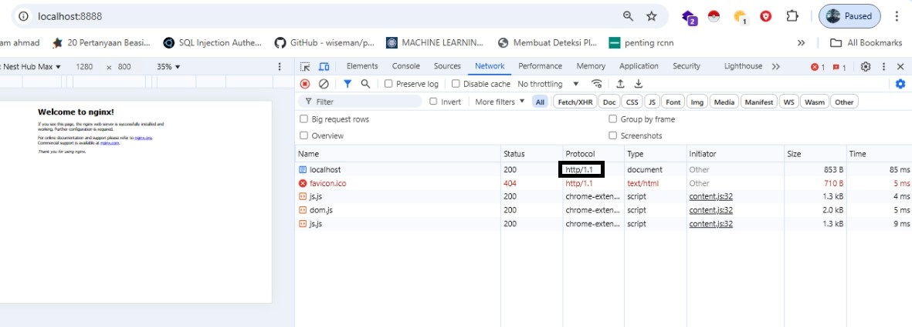
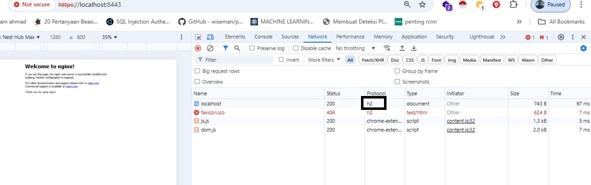
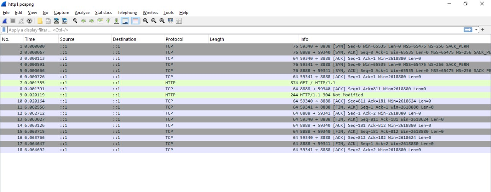
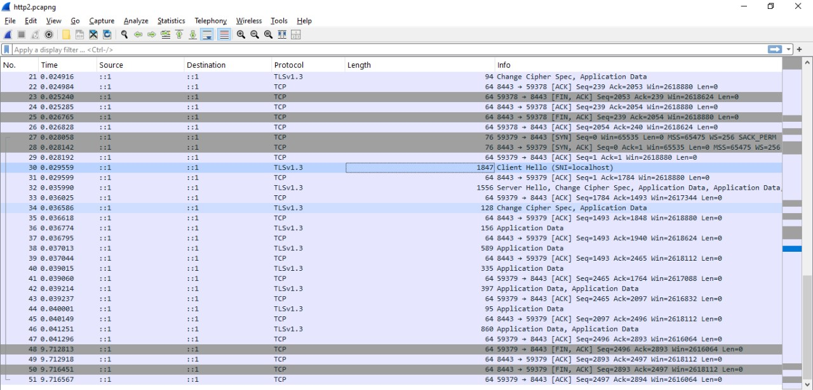

# Web Server dengan HTTP
untuk menguji apakah suatu web server menggunakan HTTP/1.1, HTTP/2.0, dan HTTP/3.0, menganalisis menggunakan Chrome, dan menganalisis lalu lintas data dengan Wireshark, berikut merupakan hal-hal yang akan dilakukan:

---

## 1. Persiapan Aplikasi

-   **Docker**, Install Docker pada [link berikut](https://www.docker.com/). Pilih sesuai dengan Sistem Operasi masing-masing. Docker digunakan untuk menjalankan web server dalam container. hal ini memungkinkan pengujian berbagai versi protokol HTTP secara terisolasi tanpa menggangu antar entitas yang lain.
-   **Wireshark**, Install Wireshark pada [link berikut](https://www.wireshark.org/). wireshark digunakan untuk menganalisis lalu lintas jaringan secara real-time.
-   **Chrome**, pastikan aplikasi Chrome terinstall dengan versi terbaru.

## 2. Konfigurasi Docker

disini saya menggunakan web server **Nginx** karena mendukung pengunaan HTTP/1.1, HTTP/2.0, dan HTTP/3.0. Sebelum melakukan Konfigurasi, pastikan Docker Engine sudah running.

**a. Donwload Image**

download image Web Server **Nginx** dari [Docker Hub](https://hub.docker.com/_/nginx) dengan perintah `docker pull nginx:latest` 

**b. Generate SSL/TLS**

SSL (Secure Sockets Layer) merupakan protokol kriptografi yang digunakan untuk mengamankan komunikasi data antara client dan server di internet. SSL ini digunakan pada HTTP/2.0 dan HTTP/3.0 untuk memastikan data yang ditransfer terenkripsi dengan aman, serta melindungi data dari intersepsi dan manipulasi oleh pihak ketiga. Pada praktiknya, SSL digantikan oleh TLS (Transport Layer Security).

perintah untuk generate nya adalah `openssl req -x509 -newkey rsa:2048 -keyout nginx.key -out nginx.crt -days 365`

**c. Konfiguasi Nginx untuk HTTP/2.0**

untuk HTTP/1.1 tidak diperlukan konfigurasi tambahan, karena Image Nginx yang sudah di pull sebelumnya secara default berjalan pada HTTP/1.1

buat file `http2.conf`  di dalam direktori root.

-   konfigurasi `http2.conf` sebagai berikut:

```
server {
    listen 443 ssl http2;
    server_name localhost;

    ssl_certificate /etc/nginx/certs/nginx.crt;
    ssl_certificate_key /etc/nginx/certs/nginx.key;

    location / {
        root /usr/share/nginx/html;
        index index.html;
    }
}
```

<!-- -   konfigurasi `http3.conf` sebagai berikut:

```
server {
    listen 443 ssl http2;
    listen 443 quic reuseport;
    listen [::]:443 ssl http2;
    listen [::]:443 quic reuseport;

    server_name localhost;

    ssl_protocols TLSv1.3;
    ssl_certificate /etc/ssl/nginx.crt;
    ssl_certificate_key /etc/ssl/nginx.key;

    http3 on;
    add_header Alt-Svc 'h3=":443"; ma=86400'; # Notify clients about HTTP/3
    add_header X-Content-Type-Options nosniff;

    location / {
        root /usr/share/nginx/html;
        index index.html;
    }
}

``` -->

**d. Create Container**

-   Container untuk HTTP/1.1
    perintah yang dijalankan adalah `docker create --name nginx-http1 -p 8888:80 nginx:latest`

-   Container untuk HTTP/2.0
    perintah yang dijalankan adalah:

    ```
    docker create --name nginx-http2 \
    -v D:/docker/http2.conf:/etc/nginx/conf.d/default.conf \
    -v D:/docker/cert:/etc/ssl:ro \
    -p 8443:443 \
    nginx:latest
    ```

<!-- -   container untuk HTTP/3.0
    perintah yang dijalankan adalah:

    ```
    docker create --name nginx-http3 \
    -v D:/docker/http3.conf:/etc/nginx/conf.d/default.conf \
    -v D:/docker/cert:/etc/ssl:ro \
    -p 443:443 \
    nginx:latest
    ``` -->

## 3. Pengujian Web Server pada Chrome

-   **HTTP/1.1**

    running container untuk HTTP/1.1 `docker start nginx-http1`. Url pada chrome adalah `http://localhost:8888`
    

-   **HTTP/2.0**

    running container untuk HTTP/2.0 `docker start nginx-http2`. Url pada chrome adalah `https://localhost:8443`
    

<!-- -   **HTTP/3.0**

    running container untuk HTTP/3.0 `docker start nginx-http3`. Url pada chrome adalah `https://localhost` -->

**4. Analisis Paket di WireShark**

Jalankan aplikasi Wireshark kemudian pilih Capture Interface nya adalah **Adapter for loopback traffic capture**.

-   **HTTP/1.1**

    berikut merupakan paket yang ditangkap dari pengujian web server dengan HTTP/1.1
    

    pada capture paket Wireshark diatas, protocol nya adalah TCP. HTTP/1.1 bekerja diatas protocol TCP.
    

-   HTTP/2.0

    berikut merupakan paket yang ditangkap dari pengujian web server dengan HTTP/1.1
    

    pada cature paket Wireshark diatas, terdapat 2 protocol yaitu TCP dan TLSv1.3. Kedua protokol, TCP dan TLSv1.3, muncul dalam capture Wireshark saat menggunakan HTTP/2.0 karena HTTP/2.0 beroperasi di atas TCP untuk pengiriman data dan di atas TLS untuk enkripsi.


