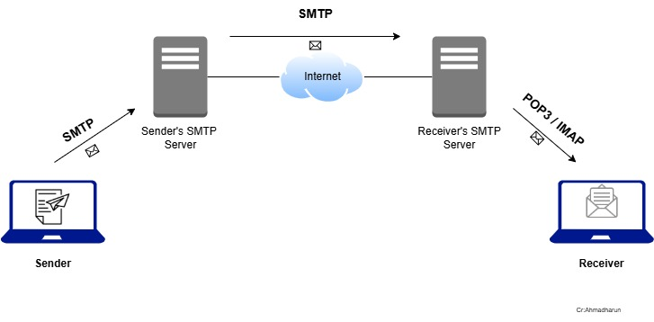

# SMTP (Simple Mail Transfer Protocol)

SMTP (Simple Mail Transfer Protocol) adalah protokol standar yang digunakan untuk mengirim email melalui jaringan. Protokol ini bekerja berdasarkan model client-server dan dirancang untuk menangani pengiriman email dari pengirim ke penerima melalui server mail.

  

## Cara kerja SMTP

**1. Pengguna Menulis dan Mengirim Email:**
-   Pengguna menulis email menggunakan aplikasi klien (Gmail, Outlook, atau Thunderbird) dan menekan tombol kirim. Aplikasi ini (Mail User Agent, MUA) mengelola email untuk diteruskan.

**2. Pengiriman ke SMTP Server Pengirim:**
-   Email dikirim ke server SMTP pengirim yang disediakan oleh penyedia layanan email. Server ini memeriksa validitas email dan siap mengirimkannya.

**3. Pencarian Alamat Server Penerima:**
-   Server SMTP pengirim melakukan pencarian DNS untuk menemukan Mail Exchange (MX) record domain penerima. Hasilnya adalah alamat IP server penerima.

**4. Pengiriman ke SMTP Server Penerima:**
Setelah menemukan alamat server tujuan, server SMTP pengirim menghubungi server SMTP penerima untuk mengirim email menggunakan protokol SMTP.

**5. Pemeriksaan oleh Server Penerima:**
Server penerima memeriksa validitas pengirim dan isi email untuk memastikan keamanan (spam atau malware). Jika valid, email diterima.

**6. Penyimpanan di Mailbox:**
Server penerima menyimpan email dalam mailbox penerima menggunakan Mail Delivery Agent (MDA). Proses ini biasanya memanfaatkan protokol IMAP atau POP3.

**7. Penerima Membuka Email:**
Penerima menggunakan klien email untuk mengambil email dari server menggunakan IMAP atau POP3. Email bisa dibaca dan dibalas, memulai kembali siklus pengiriman.

## Catatan
SMTP menangani pengiriman, sedangkan protokol IMAP/POP3 bertugas mengambil email dari server untuk ditampilkan pada klien penerima.

# IMAP dan POP3

**IMAP (Internet Message Access Protocol)** dan **POP3 (Post Office Protocol version 3)** adalah dua protokol yang digunakan untuk mengakses dan mengelola email dari server ke perangkat pengguna. Keduanya memiliki tugas yang sama—yaitu untuk mengambil email dari server dan memindahkannya ke perangkat pengguna—tetapi dengan cara yang berbeda.

**1. IMAP (Internet Message Access Protocol)**

Tugas dan Cara Kerja:
-   Memungkinkan pengguna mengakses dan mengelola email langsung di server tanpa mengunduhnya ke perangkat lokal.
-   Email tetap disimpan di server, sehingga dapat diakses dari berbagai perangkat seperti smartphone, tablet, atau komputer.
-   Menyinkronkan status pesan (dibaca, dihapus, atau dipindahkan) di semua perangkat yang terhubung.

**2. POP3 (Post Office Protocol version 3)**

Tugas dan Cara Kerja:
-   Mengunduh email dari server ke perangkat pengguna dan biasanya menghapus email dari server setelah proses selesai (opsional untuk tetap menyimpan salinan di server).
-   Email disimpan secara lokal di perangkat, sehingga tidak disinkronkan dengan server setelah diunduh.
-   Cocok untuk pengguna yang hanya mengakses email dari satu perangkat.