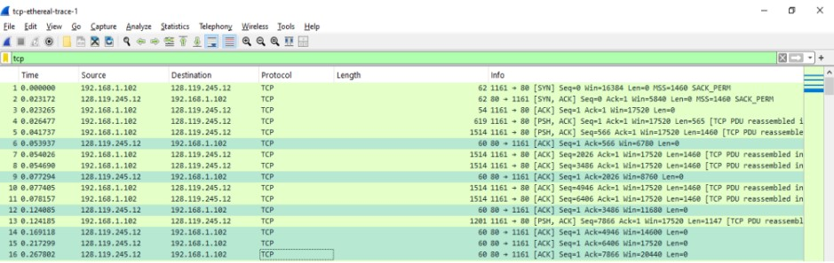

# Ujian Akhir Semester - Komunikasi dan Jaringan Komputer

**Semester Gasal Tahun Ajaran 2024/2025** 

**PROGRAM PASCASARJANA** 

**TEKNIK INFORMATIKA & KOMPUTER** 

**POLITEKNIK ELEKTRONIKA NEGERI SURABAYA** 

Kampus PENS Jl. Raya ITS Keputih Sukolilo Surabaya 60111

<table>
  <tr>
    <td>
      <strong>Mata Kuliah</strong>: Komunikasi dan Jaringan Komputer 
      <strong>Kelas</strong>: S2 IT A 
      <strong>Waktu dan Jam</strong>: 13:00-17:00 (4 jam)
    </td>
    <td>
      <strong>Dosen</strong>: Ferry Astika Saputra 
      <strong>Sifat</strong>: Terbuka 
      <strong>Hari / Tgl</strong>: Senin, 2 Desember 2024
    </td>
  </tr>
</table>

Question  below are based on the trace file tcp-ethereal-trace-1 in in http://gaia.cs.umass.edu/wireshark-labs/wireshark-traces.zip

Answer the following questions for the TCP segments:

**1. What is the IP address and TCP port number used by your client computer (source) to transfer the file to gaia.cs.umass.edu? (10%)**

_Answer_:

  <strong>Figure 1</strong>. IP Address and TCP Port Number of the client computer

From Figure 1, the IP address used by the client computer to transfer files to the server gaia.cs.umass.edu is **192.168.1.102**, with TCP port number **1161**. The identification method involves searching for TCP packets in Wireshark that have the HTTP POST protocol, which is typically used to transfer data from the client to the server. Then, check the Source Address in the Internet Protocol Version 4 tab and the Source Port in the Transmission Control Protocol tab. 

---

**2. What does gaia.cs.umass.edu use the IP address and port number to receive the file. (Attach the screenshot of your Wireshark's display) (10%)**

_Answer_:

  <strong>Figure 2</strong>. IP Address and TCP Port Number of gaia.cs.umass.edu

The IP address used by the server gaia.cs.umass.edu to receive files is **128.119.245.12**, with TCP port number **80**. The identification method involves searching for TCP packets in Wireshark that use the HTTP Response protocol, particularly packets with a status such as 200 OK, which indicates the acceptance of the request or the successful transfer of the file.

---

**3. What is the sequence number of the TCP SYN segment that is used to initiate the TCP connection between the client computer and gaia.cs.umass.edu? What is it in the segment that identifies the segment as a SYN segment? (Attach the screenshot of your Wireshark's display) (10%)**

_Answer_:

  <strong>Figure 3</strong>. Sequence Number of the TCP SYN Segment

The sequence number of the TCP SYN segment used to initiate the connection between the client computer and gaia.cs.umass.edu is **0**. This segment is identified as a SYN segment by the SYN flag visible in the TCP **Flags: 0x002 (SYN)** and also the binary value **.... ..0. .... = Syn: Set**, which indicates that this segment is the initial step in the three-way handshake process.

---

**4.	What is the sequence number of the SYNACK segment sent by gaia.cs.umass.edu to the client computer in reply to the SYN? What is the value of the ACKnowledgement field in the SYNACK segment? How did gaia.cs.umass.edu determine that value? What is it in the segment that identifies the segment as a SYNACK segment? (Attach the screenshot of your Wireshark's display) (10%)**

_Answer_:

  <strong>Figure 4</strong>. Sequence and Acknowledgement Number of the SYN-ACK Segment

The sequence number of the SYN-ACK segment sent by gaia.cs.umass.edu to the client computer in response to the SYN is **0**. 
The value in the Acknowledgement column of the SYN-ACK segment is **1**. 
This acknowledgement value is determined by the server gaia.cs.umass.edu by adding 1 to the initial sequence number of the SYN segment sent by the client computer. Since the initial sequence number of the SYN segment is 0, the acknowledgement value in the SYN-ACK segment becomes 1.

---

**5. What is the sequence number of the TCP segment containing the HTTP POST command? Note that in order to find the POST command, you’ll need to dig into the packet content field at the bottom of the Wireshark window, looking for a segment with a “POST” within its DATA field.(Attach the screenshot of your Wireshark's display) (15%)**

_Answer_:

  <strong>Figure 5</strong>. Sequence Number of the TCP Segment Containing the HTTP POST Command

The sequence number of the TCP segment containing the HTTP POST command is **1**.

---

**6.	Consider the TCP segment containing the HTTP POST as the first segment in the TCP connection. What are the sequence numbers of the first six TCP connection segments (including the HTTP POST segment)? At what time was each segment sent? When was the ACK for each segment received? Given the difference between when each TCP segment was sent, and when its acknowledgement was received, what is the RTT value for each of the six segments? What is the EstimatedRTT value (see page 237 in textbook) after the receipt of each ACK? Assume that the value of the EstimatedRTT is equal to the measured RTT for the first segment, and then is computed using the EstimatedRTT equation on page 237 for all subsequent segments. (30%) Note: Wireshark has a nice feature that allows you to plot the RTT for each of the TCP segments sent. Select a TCP segment in the “listing of captured packets” window that is being sent from the client to the gaia.cs.umass.edu server. Then select: Statistics->TCP Stream Graph->Round Trip Time Graph.**

_Answer_:

**What are the sequence numbers of the first six TCP connection segments (including the HTTP POST segment)?**

The first six segments of the TCP connection (including the HTTP POST segment) are No. 4, 5, 7, 8, 10, and 11.  
-   Segment 1: Sequence number is 1  
-	Segment 2: Sequence number is 566  
-	Segment 3: Sequence number is 2026  
-	Segment 4: Sequence number is 3486  
-	Segment 5: Sequence number is 4986  
-	Segment 6: Sequence number is 6406  

  <strong>Figure 6</strong>. The First Six Segments of the TCP Connection.

**At what time was each segment sent?**

-	Segment 1 : 0.026477
-	Segment 2 : 0.041737
-	Segment 3 : 0.054026
-	Segment 4 : 0.054690
-	Segment 5 : 0.077405
-	Segment 6 : 0.078157

**When was the ACK for each segment received?**

The ACK for each segment is No. 6, 9, 12, 14, 15, and 16.
-	Segment 1 : 0.053937
-	Segment 2 : 0.077294
-	Segment 3 : 0.124085
-	Segment 4 : 0.169118
-	Segment 5 : 0.217299
-	Segment 6 : 0.267802

  <strong>Figure 7</strong>. ACK of Segments 1-6.

**Given the difference between when each TCP segment was sent, and when its acknowledgement was received, what is the RTT value for each of the six segments?**

To calculate RTT, the formula is:  RTT = Ack Received Time – Sent Time.
-	Segment 1 : 0.02746
-	Segment 2 : 0.035557
-	Segment 3 : 0.070059
-	Segment 4 : 0.11443
-	Segment 5 : 0.13989
-	Segment 6 : 0.18964

A summary of several answers from question number 6 is provided in Table 1

<strong>Table 1</strong>. Sequence Number, Time of Transmission, ACK Receipt, and RTT for the First 6 TCP Segments.

| **Segment**   | **Time of Transmission** | **ACK Receipt Time** | **RTT**     |
|---|---|---|---|
| Segment 1 | 0.026477             | 0.053937         | 0.02746 |
| Segment 2 | 0.041737             | 0.077294         | 0.035557|
| Segment 3 | 0.054026             | 0.124085         | 0.070059|
| Segment 4 | 0.054690             | 0.169118         | 0.11443 |
| Segment 5 | 0.077405             | 0.217299         | 0.13989 |
| Segment 6 | 0.078157             | 0.267802         | 0.18964 |

**What is the EstimatedRTT value (see page 237 in textbook) after the receipt of each ACK?**

The EstimatedRTT is calculated by the equation:
EstimatedRTT (current) = 0.875 * EstimatedRTT (previous) + 0.125 * SampleRTT

**Segmen 1**:
-   SampleRTT = 0.02746
-   EstimatedRTT for segment 1 = SampleRTT = 0.02746
**Segmen 2**:
-   SampleRTT = 0.02746
-   EstimatedRTT = 0.875 * 0.02746 + 0.125 * 0.035557 = 0.0285
**Segmen 3**:
-   SampleRTT = 0.0285
-   EstimatedRTT = 0.875 * 0.0285 + 0.125 * 0.070059 = 0.0337
**Segmen 4**:
-   SampleRTT = 0.0337
-   EstimatedRTT = 0.875 * 0.0337 + 0.125 * 0.11443 = 0.0438
**Segmen 5**:
-   SampleRTT = 0.0438
-   EstimatedRTT = 0.875 * 0.0438 + 0.125 * 0.13989 = 0.0558
**Segmen 6**:
-   SampleRTT = 0.0558
-   EstimatedRTT = 0.875 * 0.0558 + 0.125 * 0.18964 = 0.0725 Second

---

**7. What is the length of each of the first six TCP segments?(Attach the screenshot of your Wireshark's display)  (15%)**

_Answer_:

  <strong>Figure 8</strong>. Data Length of the First six TCP Segment

The first six TCP segments have the following data lengths:

565 bytes, 1460 bytes, 1460 bytes, 1460 bytes, 1460 bytes, dan 1460 bytes.

---

